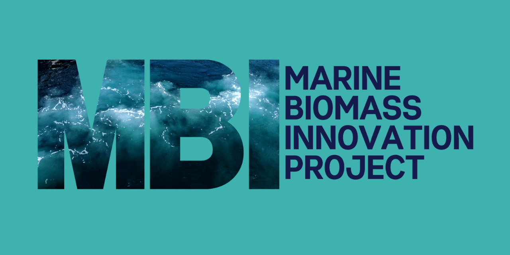

* this ordered seed list will be replaced by the toc
{:toc}

The Marine Biomass Innovation (MBI) project is a multi-year transdisciplinary research project working to develop sustainable marine based entrepreneurship for local industries and community-based organizations through repurposing of marine biomass in Newfoundland, Canada.

## What is Biomass? 

For MBI, biomass refers to material that comes from the natural world or from a process that humans use to transform that material. We are particularly interested in biomass from the ocean or marine processes, like fish species, aquatic plants, or materials that connect the ocean with the land. We are interested in both primary biomass materials (e.g. an entire fish) and material left over after processing (e.g. fish skin, shrimp shells, etc.). As we investigate the potential for innovation using these marine biomass sources, we will carefully consider not only their economic value but also their cultural, spiritual, ecological, and social value in evaluating potential opportunities.   

## Problem 

Historically, marine industries have been key economic drivers in coastal, remote, and rural regions. However, communities in such regions are often left ill-equipped to achieve the full benefit of ocean-based economic opportunities emerging from innovative technology because of capacity issues, lack of capital to invest, outmigration of youth or skilled workers, among other factors. The lack of full and efficient utilization of marine biomass is unsustainable. We recognize that cultural sustainability and healthy populations are integral to resilient rural regions and that eco-innovation is key to the economic resilience of these communities.    

## Solution 

In partnership with coastal, rural and Mi’kmaw communities across three regions on the western portion of the island of Newfoundland (Bay St. George, Bay of Islands, and Great Northern Peninsula), we seek to collaborate and co-develop sustainable, innovative, marine-based entrepreneurship opportunities and technologies for local industries and community-based organizations. We will work in partnership with community partners and industry partners to develop innovative products that are sustainable, globally competitive, and economically and technically feasible.  

## Innovation 

The MBI Project is guided by [Etuaptmumk](https://mbiproject.ca/etuaptmumk/) (Two-Eyed Seeing). Etuaptmumk refers to learning to see from one eye with the strengths of Indigenous knowledge and ways of knowing, and from the other eye with the strengths of Western knowledge and ways of knowing and learning to use both eyes for the benefit of all. The MBI Project brings together coastal, rural, and Mi’kmaw communities, academic researchers, and industry partners to employ a collaborative research approach.   

## Budget 

The total budget for the project is $15,891,023 over six years. The MBI project draws upon research supported by the Government of Canada’s New Frontiers in Research Fund (NFRF) and contributions from collaborators.

____________________________

# Governance Structure

The MBI Project is guided by a governance plan. The governance plan describes the overall governance and decision-making process for the MBI Project and its team members, partners, participants, and other individuals and organizations related to the project. The project, and the governance plan, are guided by a multi-faceted, inclusive, participatory, multisectoral, and interdisciplinary approach to governance and project management.  

To ensure both effective communication across the team, and that the project remains focused on its goals and guiding frameworks, the project has a well-established management structure consisting of a Project Management Committee (PMC), Administration Leadership Team (ALT), Monitoring and Evaluation Advisory Committee (MEAC), three Regional Community Advisory Committees (RCAC), and eight Work Package Teams (WPTs).

***

> Governance Structure Diagram detailing the Project Management Committee (PMC), Administration Leadership Team (ALT), Monitoring and Evaluation Advisory Committee (MEAC), three Regional Community Advisory Committees (RCAC), and eight Work Package Teams (WPTs).

The project partners are at the core of the project’s management structure. This includes representatives from industry, Mi’kmaq, and other community partners and stakeholders. Additional individuals and entities who may not be officially linked to the project, such as government representatives, entrepreneurs, and others, will be invited to join the MEAC and RCACs. This will add to the project’s capacity, as well as the impact of its outcomes among an extensive network of regional stakeholders.  

A strong relationship of collaboration will also be required within and between the different WPTs since data and materials will inform subsequent WPT research in reciprocal ways. An online yearly meeting (or in-person when possible) of all committees and teams will be held to facilitate integration and monitor progress. Additional full team meetings, including partners, will be held as needed.  

| **ROLE**                                           | **RESPONSIBILITY**                                                                                                                                                                                                                                                                                                                                                                                                                                                                                           |
| ---------------------------------------------- | -------------------------------------------------------------------------------------------------------------------------------------------------------------------------------------------------------------------------------------------------------------------------------------------------------------------------------------------------------------------------------------------------------------------------------------------------------------------------------------------------------- |
| **Nominated Principal Investigator (PI)**          | The PI has primary responsibility for the overall intellectual direction of the research and is accountable, with the host institution (MUN), for overall coordination of the grant’s overall financial and administrative aspects.                                                                                                                                                                                                                                                                      |
| **Co-principal Investigator (Co-PI)**              | The Co-PI assumes project leadership when the PI is not available. Shares intellectual leadership with the PI and other team members; plays a significant role in planning and conducting the research.                                                                                                                                                                                                                                                                                                  |
| **Project Management Committee (PMC)**             | The PMC exists to ensure oversight, reporting, and integration, with the ultimate responsibility to ensure the success of the MBI Project. The PMC meets to establish policy, receive project status updates, ensure decisions and research activities align with the project’s scope, schedule, and budget, and monitor progress against goals to ensure accountability.                                                                                                                                |
| **Administration Leadership Team (ALT)**           | The ALT exists to ensure the project meets all policies, protocols, and requirements of the institutions, partners, and funding agencies and to guide the implementation of the project with emphasis on ensuring that the goals, objectives, and activities underpinning it always remain central to the initiative.                                                                                                                                                                                    |
| **Regional Community Advisory Committees (RCACs)** | Three RCACs will support regional components of the project on the Great Northern Peninsula, in the Bay of Islands and in Bay St. George. These committees will help to ensure regional engagement with the project, including rural, coastal, and Mi’kmaq communities, academic partners, businesses, organizations, and other partners. The three RCACs may also come together occasionally to discuss broader project themes/objectives impacting all three regions.                                  |
| **Monitoring and Evaluation Advisory Committee**   | The MEAC exists to provide input and support to the Marine Biomass Innovation Project in relation to milestones, timelines, Etuaptmumk, and developmental approach on an ongoing basis.                                                                                                                                                                                                                                                                                                                  |
| **Work Package Teams**                             | The eight WPTs exist to carry out research as outlined in the project proposal. The ultimate goals of the WPTs are specific to the individual WPT. Each WPT is led by a lead or co-leads. The WPT leads and co-leads ensure engagement of all WPT members and update the Project Manager, ALT, and PMC, on their timelines, milestones, and deliverables, and how Etuaptmumk is informing their research.                                                                                                |
| **Trainee Network**                                | The Trainee Network works alongside communities and industry partners while also engaging with government and other stakeholders, to implement research findings and expose communities and participating stakeholders to new and emerging sustainability opportunities illuminated by the project. The Trainee Network serve as valuable, contributing members of their WPTs and, with the guidance of their respective WPT lead(s), play a key role in helping WPTs attain their goals and objectives. |
