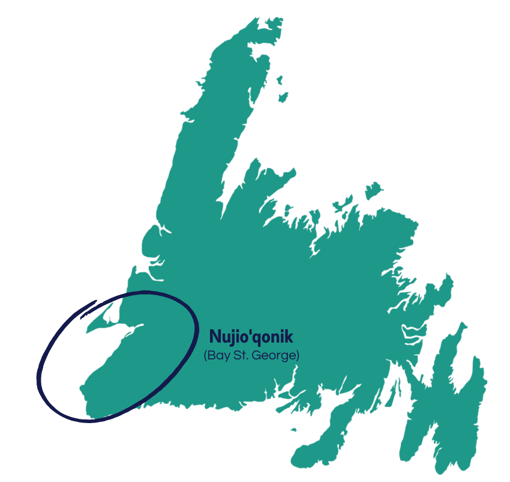

* this ordered seed list will be replaced by the toc
{:toc}

## Mi'kmaw Project Partners
### Bay St. George

Bay St. George is a unique area on the southwest corner of Newfoundland, with vibrant Mi'kmaw communities surrounding the ocean and a picturesque landscape nearly as beautiful as its people. The long rich history of Mi'kmaw use and occupancy of Newfoundland starts in Bay St. George. This portion of the island was visible, and navigable by the sea in ocean-going canoes, from Cape Breton. 

  

#### Flat Bay Band

Flat Bay Band/No'kmaq Village is a non-profit village council encompassing the Mi’kmaw communities of Flat Bay East, West & St. Teresa. The Band is over 50 years old and is the oldest surviving band in the province outside of the Miawpukek First Nation, which Flat Bay helped form. Historically, Flat Bay Mi’kmaq managed their community affairs through a process whereby the most senior and knowledgeable person would take charge of dealing with the resolution process; this remains the case to this day. Flat Bay is the only community in Canada that self-governs without a government budget or municipal support such as a town council, or local service district. For the past 50 years, Flat Bay has avoided colonial-style government, where policies are developed, passed down, and imposed on the people. The unique system originates from the Mi'kmaw of Flat Bay and is carried out by the Band Council. 

Duly elected by the democratic process in June 1971, and incorporated in 1974, Flat Bay Band is a highly credible, incorporated body in good standing, free of litigation, and without a single encounter with funding agents. The Flat Bay Band has contributed to many of the key advancements throughout the decades in forging recognition for Mi'kmaq in Newfoundland.  

The Flat Bay Band mission is to maintain a self-governance structure, to deliver social development, environmental heritage, wellness, and community economic initiatives, and to preserve Mi’kmaw culture by restoring identity, encouraging pride, and unity, and supporting spiritual and artistic expression. 
