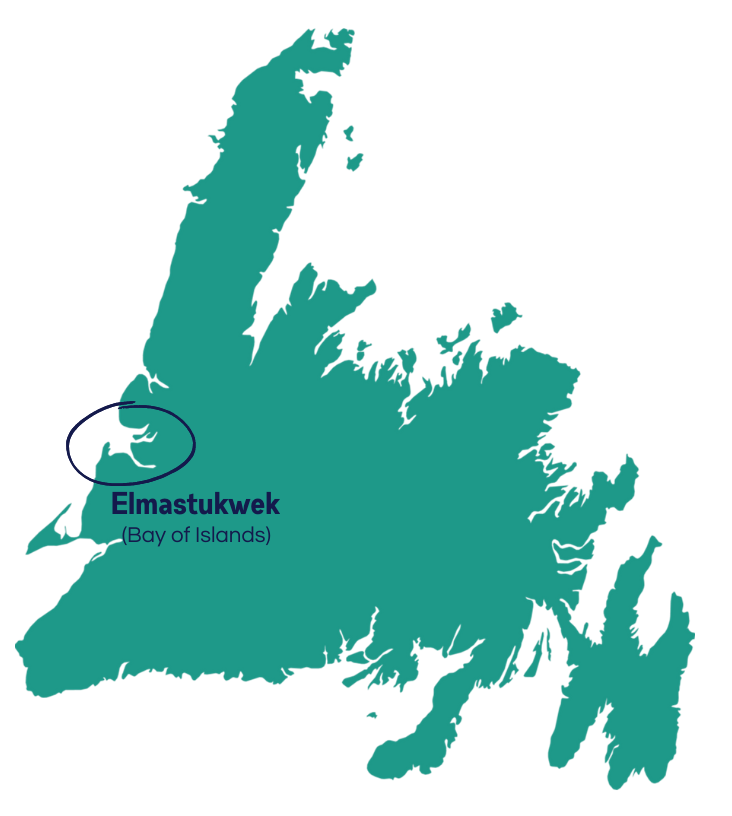

* this ordered seed list will be replaced by the toc
{:toc}

## Mi'kmaw Project Partners
Without the Mi'kmaw Project Partners, this

### Bay St. George

Bay St. George is a unique area on the southwest corner of Newfoundland, with vibrant Mi'kmaw communities surrounding the ocean and a picturesque landscape nearly as beautiful as its people. The long rich history of Mi'kmaw use and occupancy of Newfoundland starts in Bay St. George. This portion of the island was visible, and navigable by the sea in ocean-going canoes, from Cape Breton. 

  

#### Flat Bay Band

Flat Bay Band/No'kmaq Village is a non-profit village council encompassing the Mi’kmaw communities of Flat Bay East, West & St. Teresa. The Band is over 50 years old and is the oldest surviving band in the province outside of the Miawpukek First Nation, which Flat Bay helped form. Historically, Flat Bay Mi’kmaq managed their community affairs through a process whereby the most senior and knowledgeable person would take charge of dealing with the resolution process; this remains the case to this day. Flat Bay is the only community in Canada that self-governs without a government budget or municipal support such as a town council, or local service district. For the past 50 years, Flat Bay has avoided colonial-style government, where policies are developed, passed down, and imposed on the people. The unique system originates from the Mi'kmaw of Flat Bay and is carried out by the Band Council. 

Duly elected by the democratic process in June 1971, and incorporated in 1974, Flat Bay Band is a highly credible, incorporated body in good standing, free of litigation, and without a single encounter with funding agents. The Flat Bay Band has contributed to many of the key advancements throughout the decades in forging recognition for Mi'kmaq in Newfoundland.  

The Flat Bay Band mission is to maintain a self-governance structure, to deliver social development, environmental heritage, wellness, and community economic initiatives, and to preserve Mi’kmaw culture by restoring identity, encouraging pride, and unity, and supporting spiritual and artistic expression. 

#### Benoit First Nation 

Benoit First Nation is a L’nui’suti Regional Cultural and Language Band. Benoit First Nation was established in 2005 to revive the original Port au Port Indian Band from the 1970s under a new name. The Band provides regional and local Lnu'k/Mi'kmaq programming and activities in culture, language, traditions, and more. Benoit First Nation works to strengthen their community and educate their children, exposing them to the true Mi'kmaw history of the region. The Band also works to provide Elder support and food security for vulnerable households. Although supportive of regional cooperation, involvement, interaction, communication, sharing, and partnerships, Benoit First Nation is an independent regional Lnu'k/Mi'kmaq Community.  

Since time immemorial, Lnu'k/Mi'kmaq have had a prominent presence in St. George's Bay (Nujio'qoniik) and on Payun Aqq Payunji'j (the Port au Port Peninsula). Many Lnu'k/Mi'kmaq ancestors came from around Pitu'pa'q (Bras d'Or lakes) in Nova Scotia and New Brunswick. Currently, many distant relatives of Benoit First Nation members continue to live on Reserves there. The Mi'kmaq of Benoit First Nation peacefully co-existed with the Red Ochre people (Beothuk), and through intermarriage, have many connections between the two.  

As a result of being penciled out of the 1949 Confederation with Canada along with all other Indigenous Groups in Newfoundland and Labrador, the Lnu'k/Mi'kmaq were not registered and without official rights. Since then, the Indigenous Peoples of Newfoundland and Labrador have come together to protect their rights and heritage. 

#### Indian Head First Nation 

Indian Head First Nation (IHFN) is a First Nation Band that includes both status and non-status Mi'kmaq who are from, or, have a familial connection to Nujio'qonik (Bay St. George), specifically the Stephenville, Stephenville Crossing, and Kippens area.  

Indian Head has existed for hundreds of years and was mentioned in the writings of W.E. Cormack on his historic journey across Newfoundland in the early 1800s. In 1822, Cormack listed 150 Mi'kmaq living at Indian Head with the family names of Benoit, Alexander, Lucoos, Young, Marche, LeBlanc, Gallant, Gabriel and Cormier.  

The community was first known as L'ans Savage. Later it was changed to be called Indian Head, and then finally, Stephenville. Mi'kmaq, Montagnais, and Beothuk all have fished, camped and lived in the area from at least the early 1500s and earlier. 

#### St. George’s Band 

The St. George’s Indian Band is a non-profit Mi’kmaq organization established in 1989 and incorporated in 2003. The Band is comprised of a Chief, Vice-Chief, secretary, treasurer, four directors, an Elder, and a youth representative who are elected in a democratic process every four years. As a First Nation’s Band Council, the St. George’s Indian Band strives to promote cultural awareness and a sense of pride in Mi’kmaq heritage. Band priorities include education, health, economic development, improved housing, cultural enhancement, tourism, and recreation.  

The community of St. George’s is an area rich in Mi’kmaw history. The earliest occupation of the area is uncertain, however, the area known as Seal Rocks which is now a part of the community of St. George’s is well documented as being the largest and principal Mi’kmaq settlement in the 17th, 18th, and 19th centuries. St. George's was established in 1804 as the first permanent settlement of Mi’kmaq People in Newfoundland for the resettlement of the Mi’kmaq of Nova Scotia. Mi’kmaq oral tradition maintains that the Mi’kmaq occupation of the area is ancient.  

The Band currently represents approximately 1700 members inside the province of Newfoundland and Labrador, with another 500 outside of the province. St. George's Band's spiritual grounds are located in different areas throughout Bay St. George including Steel Mountain, Mendueuge (Devil’s Place), Calvary Hill, Hell’s Gulch, Hungry Grove, Seal Rocks, Molly Ann’s Cove, and the Mouth of Barachois.  

#### Three Rivers Mi’kmaq Band 

People living in the stretch of Bay St. George South from Heatherton to Highlands are represented by the Three Rivers Mi'kmaq Band Chief and Council. The Band serves the communities of Heatherton, Robinsons, Cartyville, McKay’s, Jeffrey’s, St. David’s, St. Fintan’s, Loch Leven, and Highlands. The Band’s mandate is to help lead communities toward sustainability and a brighter future.  

The Three Rivers Mi’kmaq Band was incorporated as a non-profit organization and recognized as an Indigenous service provider by Indigenous Services Canada. The Band now has over 400 members — both living in the area and outside, they include status and non-status people.  

The Band strives to provide food hampers for seniors, do wellness checks, purchase computers for kids, help people navigate paperwork they may need to complete, and participate in drives to provide food for members at no cost. The Band has opened a trading post, which includes a convenience store, a gas station, and a used clothing store. Those enterprises have employed people and provided them with reasons to stay in the area. 

### Bay of Islands

The Bay of Islands is a mountainous region in Western Newfoundland with longstanding connection to Mi'kmaw culture. A sheltered bay with ample fishing opportunity and easy access to excellent inland hunting grounds has provided a safe haven and bounty for all those who have chosen to call the Bay of Islands home.  

