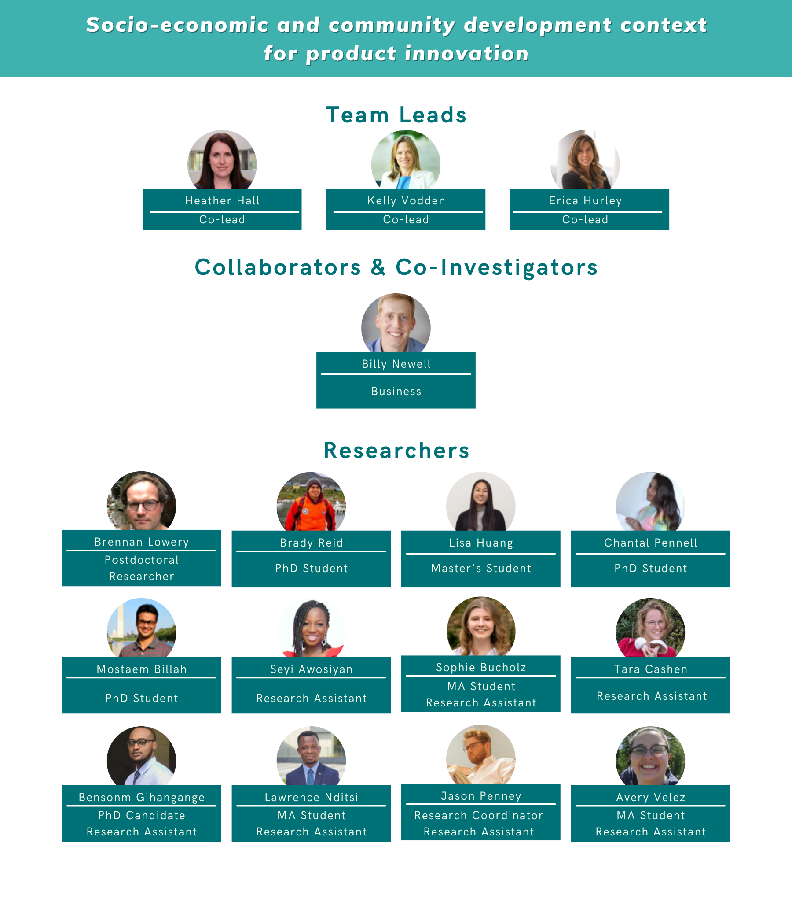
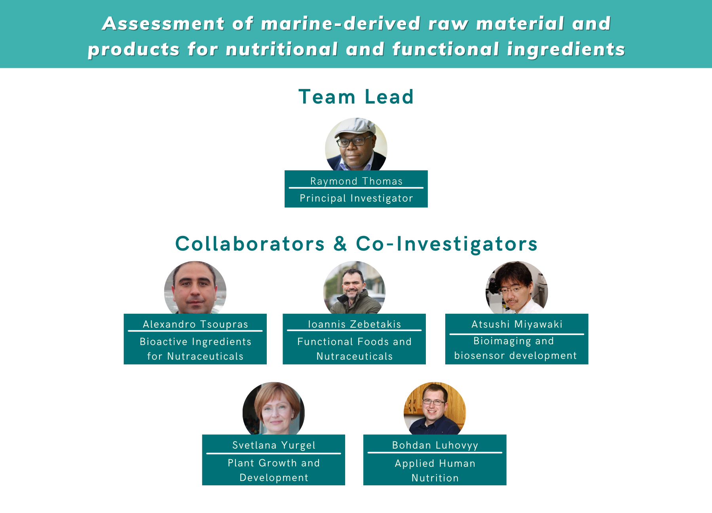
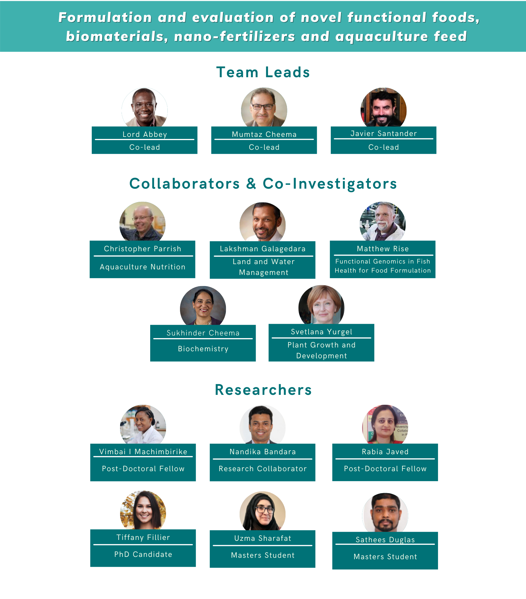
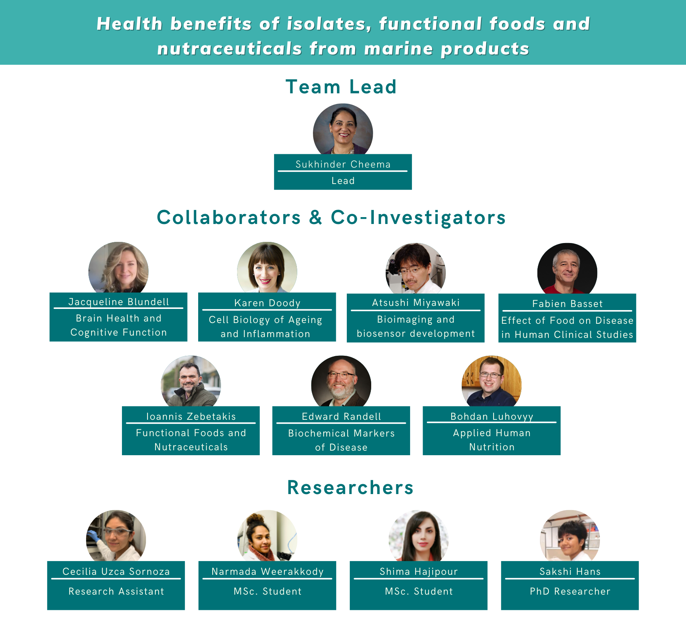
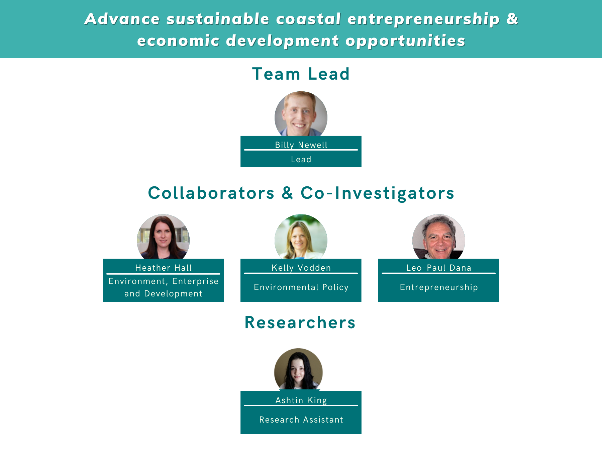
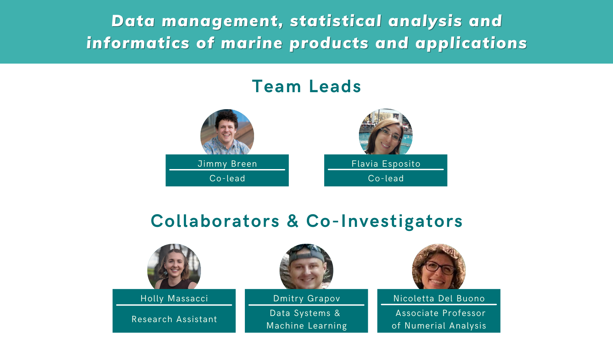

The MBI project is highly collaborative with research partners around the world. The researchers on this project are split across eight 'work packages', each with their own focus, goals and methodologies.

## Work Package Teams

Assessment of the socio-economic and community development context for product innovation. The purpose of this work package is to develop an understanding of the economic and cultural histories of coastal communities, especially in relation to fish waste. The Chiefs from Mi’kmaw partner communities and the Indigenous Community Liaisons are all key members of the WP1 research team. 

Objectives:
1. Document past and current relationships with the ocean in partner communities, including ocean related industries, their histories, traditions and identities.
2. Conduct a community asset assessment to identify existing capacities, entrepreneurial interests, and physical assets.
3. Identify the types of organizational and governance structures that will advance product innovation.

Develop innovative processing approaches for extracting value from marine raw materials which can help to create economic and entrepreneurial opportunities for the project regions. Shellfish (e.g., crab, mussels, shrimp) and finfish processing by-products (i.e., guts, trimmings, bones, shell), sea cucumber, and seaweed are the primary feedstocks being considered. Existing processes which can extract high value compounds from such materials are limited to lab scale, use toxic chemicals or aggressive operating conditions, and/or are not appropriate for remote and rural locations. 

Objectives:
1. Develop innovative ‘green’ processes that can extract or convert fish processing by-products and raw materials - primarily feedstocks identified by work packages 3-5 into value added secondary products ranging from nutraceuticals to biomaterials. 
2. Act as a resource for processors and regions to build a sustainable fishery and export knowledge and processes created nationally and internationally. 

Research conducted by this work package seeks to assess the quality and safety of marine-derived materials using a multimodal metabolomic approach. Various analytical techniques will be employed, including molecular genetics, vibrational spectroscopy, chromatography, and mass spectrometry. Results obtained are expected to provide insight into marine-derived materials’ spatial, qualitative and quantitative composition. Such insight will facilitate targeted product development for applications, including functional foods, nutraceuticals, cosmetics, and biofertilizers.

Objectives:
1. Assess the quality of raw materials or extracts for purity and composition of bioactive compounds.
2. Assess the safety of raw materials or extracts to determine contaminant levels for product development by WPT4-5.
3. Support and guide other work package teams with product development and market development.

The goals will be to investigate the development, formulation and testing of functional foods, biomaterials and nano-biofertilizers from the extracts and waste/residues. 

Objectives:
1. Develop marine-based functional foods or nutraceuticals.
2. Develop nano-biofertilizer using residues identified by WPT1, and secondary by-products identified in WPT2.
3. Devlop recommendations for industry and community stakeholders regarding marine biomass for sustainable agriculture production for improved food security in rural, coastal and Indigenous communities.
4. Develop fishery residues as feed ingredients for aquaculture.
5. Develop bio-materials and biosensors from marine-based organisms such as eels.

The purpose and goals of work package 5 are to assess the health benefits of raw materials, novel extracts, and other bioactives from marine biomass. Targeted diseases are: diabetes, obesity, cardiovascular diseases, arthritis, cancer, brain health, inflammation, cell-cycle regulation, and other related metabolic disorders. In-vitro cell culture models will be used for rapid screening of extracts / isolates / bioactives for their potential health benefits. Marine isolates and bioactives showing potential for health benefits will then be tested in animal models to establish dose, duration, sex-specific effects, safety, efficacy, and toxicity. Specialized techniques (bioluminescence imaging) will be used to study brain function. Furthermore, the health benefits of developed functional foods and nutraceuticals will be confirmed in specific animal models. Human clinical trials will be conducted to evaluate the efficacy of existing and/or newly developed functional foods and nutraceticals to bring niche products to market. Data generated will be shared with other work packages to ensure the informatics database developed by the consortium is comprehensive, useful and translational to project-partners and industry. In collaboration with community and industry partners, novel products will be launched to improve population and community health, particularly in rural, coastal and Indigenous communities.

Objectives:
1. Identify marine biomass for potential health benefits. Work with WPT2 to generate isolates/bioactives and to determine if scale-up is warranted.
2. Work with WPT3 to conduct qualitative/quantitative analysis of targeted isolates, and conduct cell culture (rapid testing), and animal studies (safety, dose, efficacy) to establish health benefits.
3. Work with WPT4 to develop functional foods and nutraceuticals, conduct animal studies and human clinical trials to establish health benefits.
4. Share functional foods/nutraceuticals showing promise with WPT1/6-8 and support them to determine markets for novel isolates and bioactives identified.

Advancement of opportunities through:
1) governance structure and ongoing engagement processes to facilitate co-construction of knowledge; 
2) integrate findings to assess their socio-economic potential and community interest/acceptance for foundation of pilot commercialization; 
3) evaluate the process/incorporate capacity building.

Objectives:
1. Determine the potential value of the proposed products in WPT2-5, and the customer segments to whom this value would apply.
2. Examine the alignment between these commercial opportunities and the community assests, identities, and socio-cultural contexts explored in WPT1.
3. Explore how the commercialization of these potential products/processes boost existing economic capacities and support the launch of new entrepreneurial possibilities.

Facilitate interconnection between other work packages, following Memorial University’s public engagement model which upholds that engagement is built on mutual contribution, is based on mutual respect, and ought to generate mutual benefit.

Objectives:
1. Design, implement and support effective and meaningful public engagement activities with particular emphasis on Indigenous community participation, while adhering to Memorial University's Public Engagement Framework.
2. Design, implement and support knowledge exchange and mobilization activities for diverse audiences within and across project regions.
3. Conduct and support overall project and WPT assessment, monitoring, and evaliuation acitivieis that will ensure continuous project improvement and attainment of project goals and WPT objectives.

Establish a data management system for the project such that data generated by all research teams are consolidated for integration and collaboration between WPTs. The team aims to help in the understanding of the relationships between the data collected across the various disciplines and support other work packages to make more informed coordinated project decisions.

Objectives:
1. Develop data management systems capable of holding and analysing databases created across all work packages and sites.
2. Develop multivariate analysis solutions to assess the value of marine products.

For the analysis, the WPT8 at Uniba (Italy) will take advantage of established workflows by their work group by using computational techniques such as Exploratory Data Analysis, Dimensionality Reductions, Clustering, and supervised approaches. The appropriate methodology will be assessed taking into account: 
i) preliminary assumptions of the marine domain also provided by other WPTs as well Indigenous communities, 
ii) computational and interpretable performances (such as goodness, robustness, or scalability of the proposed methodology), 
iii) structure of data under study and 
iv) their ability to link biological systems and industrial scenarios
