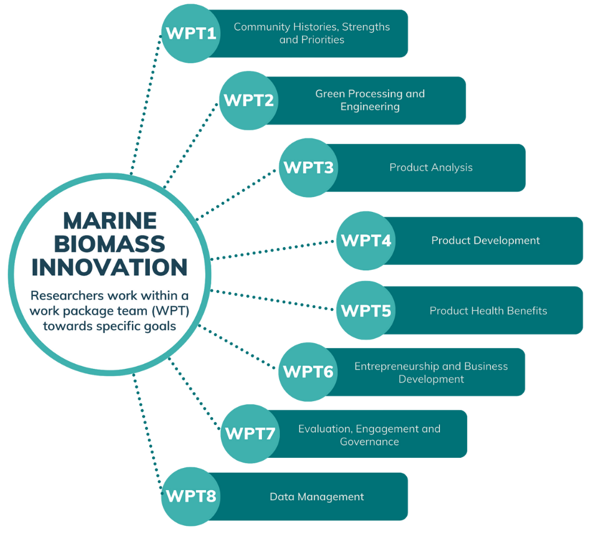

1. this ordered seed list will be replaced by the toc
{:toc}

# Project Management

<html>
  <body>

  </body>
</html>

The MBI project is highly collaborative with research partners around the world. The researchers on this project are split across eight 'work packages', each with their own focus, goals and methodologies.

# Work Package Teams

There are eight different WPTs working together on the MBI Project. The interrelated WPTs, which establish an integrated approach to assess, repurpose, and develop biomass products. Each Work Packages' team members, purpose and objectives are detailed below.

## Work Package 1

<html>
  <body>

  </body>
</html>

**WPT1 Purpose:**

Assessment of the socio-economic and community development context for product innovation. The purpose of this work package is to develop an understanding of the economic and cultural histories of coastal communities, especially in relation to fish waste. The Chiefs from Mi’kmaw partner communities and the Indigenous Community Liaisons are all key members of the WP1 research team. 

**WPT1 Objectives:**
1. Document past and current relationships with the ocean in partner communities, including ocean related industries, their histories, traditions and identities.
2. Conduct a community asset assessment to identify existing capacities, entrepreneurial interests, and physical assets.
3. Identify the types of organizational and governance structures that will advance product innovation.

